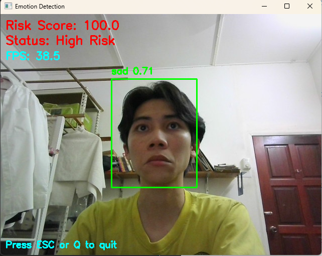

# Real-Time Emotion Risk Screening System (YOLOv8)

## Overview
This project is a real-time facial emotion detection system using YOLOv8 and OpenCV.

It detects emotions from webcam video and calculates a simple risk score based on emotion trends.

## Features
- Real-time webcam emotion detection
- YOLOv8 custom-trained model
- GPU acceleration (CUDA)
- Emotion trend scoring
- Excel logging
- Visualization support

## Technologies Used
- Python
- YOLOv8 (Ultralytics)
- OpenCV
- PyTorch
- Pandas

## Demo


## How to Run

### 1. Install dependencies
```bash
pip install ultralytics opencv-python pandas openpyxl matplotlib
```
### 2. Launch Jupyter Notebook
```bash
jupyter notebook
```
### 3. Open the project file
Open the following file in Jupyter:
```bash
Webcam detection.ipynb
```
### 4. Update model path
In the notebook, replace the model path with your trained YOLOv8 model:
```bash
C:/Users/your_path/emotion_detect_final_best.pt
```
### 5. Run the system
```bash
Run all cells to start real-time emotion detection using webcam.
```
Note: This project uses Jupyter Notebook for demonstration purposes.
